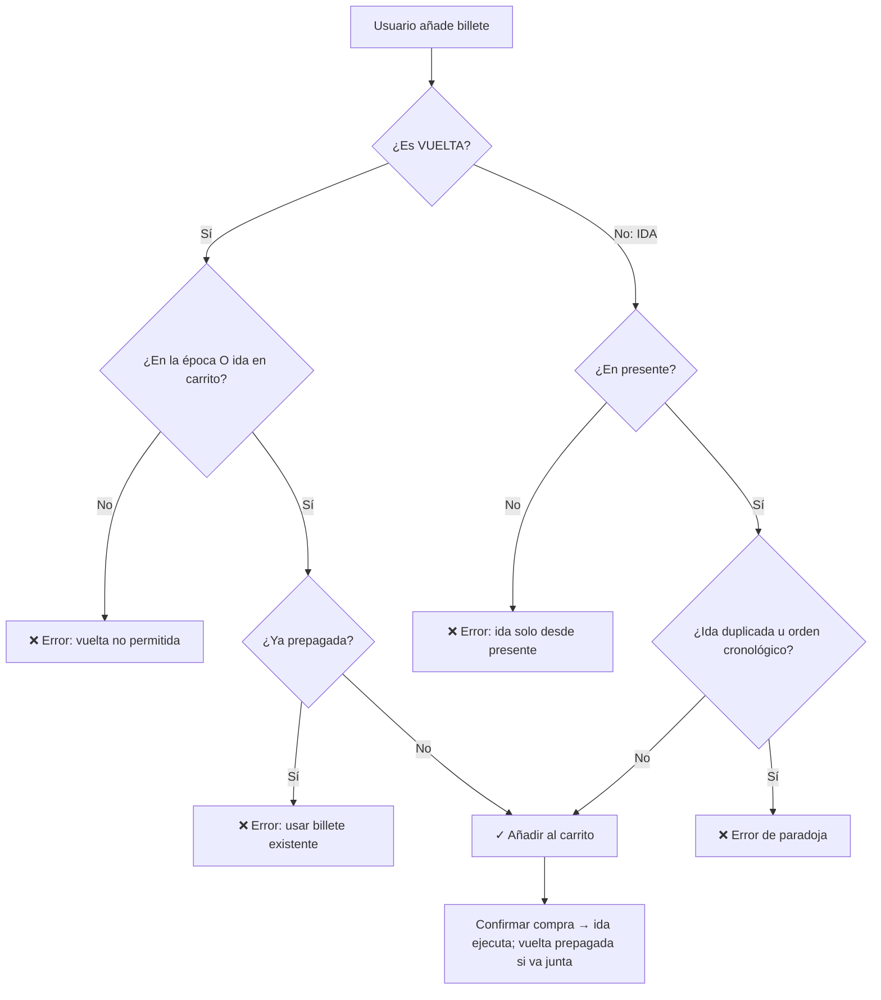

# ⏳ Para luego es tarde — Viajes a tiempo S.M.L.

> **No esperes, ¡SALTA!**

Tienda web Java para vender billetes de viajes temporales. Proyecto educativo diseñado para **romper el esquema de la típica tienda online** y obligar a leer el código por curiosidad, ya que cuando tengo tiempo libre me da por pensar y hacer cosas mientras espero la excepción que no da llegado.

## El producto

Billetes oficiales a tres destinos (por el momento):

| Destino | Año temporal | Riesgo |
|---------|-------------|--------|
| 🦖 Era de los Dinosaurios | 66.000.000 a.C. | 9.8/10 |
| 🏛️ Antigua Roma | 117 a.C. | 4.2/10 |
| 🚀 Año 3000 | 3000 d.C. | 6.5/10 |

## La locura temporal que pensé

### Años negativos (`AnoTemporal`)

Record con tipado fuerte (`int valor`) que encapsula la lógica temporal:

```java
public record AnoTemporal(int valor) {
    public AnoTemporal {
        if (valor == 0) throw new IllegalArgumentException(
            "El año 0 no existe en la continuidad espacio-temporal.");
    }
    @Override
    public String toString() {
        return valor < 0 ? Math.abs(valor) + " a.C." : valor + " d.C.";
    }
}
```

- Convención: `-117` = 117 a.C., `3000` = 3000 d.C.
- El **año 0 no existe** → lanza `IllegalArgumentException`
- Comparación cronológica: `-66_000_000 < -117 < 2026 < 3000`

### El presente (`LineaTemporal.ANHO_ACTUAL = 2026`)

El sistema usa **2026** como ancla del «ahora». Todo el combustible temporal se mide desde ese punto.

| Pregunta | Respuesta |
|----------|-----------|
| ¿El 2024 es pasado? | Sí, respecto a 2026 (`esPasadoRespectoAlPresente`) |
| ¿Puedo comprar billete al 2024? | **No.** Solo existen destinos del catálogo (`Era`) |
| ¿Hacia dónde se viaja? | Solo saltos a épocas registradas: dinosaurios, Roma, año 3000 |

### Precio dinámico (`CalculadoraPrecios`)

Cada billete suma cuatro conceptos. Los ves desglosados en el catálogo, en la ficha de cada era y en el carrito:

```
precio total = 49,99 € (base fija)
             + combustible temporal
             + recargo por riesgo histórico
             + seguro Efecto Mariposa
```

El **origen del viaje** es tu posición actual en sesión (normalmente el presente en la ida; la época en la que estés en la vuelta).

#### ⛽ Combustible temporal — «cuántos años cruzas»

Es el coste de **atravesar la línea temporal**: cuanto más lejos viajas en años, más combustible consume la máquina del tiempo.

- Se mide la **distancia en años** entre origen y destino (siempre en valor absoluto).
- **Viajes largos** (≥ 1 millón de años): se cobra **0,15 € por cada millón completo** de años.
- **El resto** (o viajes cortos): **0,008 € por año**.

Por eso ir a los dinosaurios (~66 millones de años) no cuesta una fortuna: los tramos prehistóricos tienen tarifa reducida por bloques de millón. Roma o el año 3000, al estar cerca del presente, pagan casi todo al precio «por año».

*Ejemplo (ida desde 2026):* Roma (~2.143 años) ≈ **17 €** de combustible; Dinosaurios (~66 millones de años) ≈ **26 €**.

#### ⚠️ Riesgo histórico — «qué tan peligroso es el destino»

No todas las épocas son igual de arriesgadas. Cada destino (`Era`) tiene un **índice de riesgo de 0 a 10** que refleja lo inestable o hostil que es quedarse allí:

| Destino | Índice | Recargo (× 12,50 €) |
|---------|--------|---------------------|
| Dinosaurios | 9,8 / 10 | 122,50 € |
| Antigua Roma | 4,2 / 10 | 52,50 € |
| Año 3000 | 6,5 / 10 | 81,25 € |

Fórmula: `recargo riesgo = índice de la era × 12,50 €`

Dinosaurios encarecen mucho por depredadores y caos; Roma es más «civilizada»; el futuro tiene incertidumbre tecnológica intermedia.

#### 🦋 Seguro Efecto Mariposa — «la línea temporal no es estable»

Inspirado en la paradoja del efecto mariposa: un pequeño cambio al viajar puede alterar el precio final del salto.

- Es un **porcentaje aleatorio entre -1 % y +1 %** aplicado al subtotal (base + combustible + riesgo).
- Se recalcula en **cada petición HTTP** (`@RequestScope`): al recargar la página o volver al catálogo, el porcentaje puede cambiar.
- Puede **subir o bajar** el precio un poco: a veces es descuento, a veces recargo.

*Ejemplo:* subtotal 200 € y seguro +0,43 % → +0,86 €; con -0,87 % → -1,74 €.

Es intencional: simula que el tejido temporal fluctúa y no puedes fijar el precio exacto hasta que consultas el billete en ese momento.

### Posición del viajero (`ServicioPosicionViajero`)

Cada sesión guarda **dónde estás** en la línea temporal (visible en la barra de navegación):

- Al entrar → presente (2026 d.C.)
- Tras confirmar una **ida** → te mueves a la época destino
- Tras **usar** un billete de vuelta prepagado → vuelves al presente
- Tras comprar **solo vuelta** estando ya en la época → regreso inmediato al confirmar

### Ida, vuelta y billetes prepagados

| Situación | Ida | Vuelta (carrito) | Usar vuelta prepagada |
|-----------|-----|------------------|------------------------|
| En el presente | ✅ | ✅ si ida en carrito | — |
| En una época (ida pagada) | ❌ | ✅ si no hay prepagada | ✅ si compraste ida+vuelta juntas |

Si compras **ida + vuelta** en el mismo pedido: al confirmar solo se ejecuta la ida; la vuelta queda **prepagada** y se usa con el botón «Viajar al presente» en la época destino.

### Paradojas (`ValidadorParadojas`)

El carrito **impide**:
- Comprar ida estando fuera del presente
- Comprar vuelta sin ida en carrito (desde presente) ni estando en la época
- Comprar otra vuelta si ya tienes una prepagada sin usar
- Billete de vuelta anterior al de ida (no puedes volver antes de haber llegado)
- Dos idas al mismo destino
- Encadenar viajes fuera de orden cronológico



Documentación ampliada en `/logica-temporal`.

### Aventuras «Elige tu propia aventura»

Encuentros textuales por sesión HTTP. Solo se pueden jugar **estando físicamente en la era** correspondiente (tras confirmar una ida). Cada escena se juega **una vez por sesión**.

| Ruta | Descripción |
|------|-------------|
| `/aventuras` | Listado de escenas disponibles y completadas |
| `/aventuras/{id}` | Escena con opciones (formularios POST) |
| `/aventuras/resultado` | Narrativa y consecuencias tras elegir |

**Estado en sesión** (`ServicioAventuras`):

- **Créditos** — moneda virtual; 1 crédito = 1 € de descuento en el carrito
- **Inventario** — objetos coleccionables (solo narrativos por ahora)
- **Descuento %** — se aplica a la próxima compra y se consume al pagar
- **Paradoja activa** — flag de humor tras decisiones caóticas

#### Crear una aventura nueva

1. Abre `CatalogoAventuras.java` y añade un bloque `new EscenaAventura(...)` a la lista `TODAS`:

```java
new EscenaAventura(
    "mi-aventura-id",          // URL: /aventuras/mi-aventura-id
    Era.ROMA,                  // era donde se activa
    "Título de la escena",
    "Resumen de una línea para el listado",
    "Párrafo de introducción narrativa…",
    List.of(
        new OpcionAventura(
            "opcion-a",
            "Texto del botón A",
            "Texto resultado al elegir A…",
            EfectosOpcion.creditos(50)   // atajo para +50 créditos
        ),
        new OpcionAventura(
            "opcion-b",
            "Texto del botón B",
            "Texto resultado al elegir B…",
            new EfectosOpcion(
                -30,                              // cambioCreditos
                false,                            // activarParadoja
                Optional.empty(),                 // destinoForzado (salto a otra era)
                Optional.of("Objeto raro"),       // objetoInventario
                10,                               // descuentoProximaCompraPorcentaje
                false                             // regresarAlPresente
            )
        )
    )
),
```

2. Recompila: `mvn clean spring-boot:run`. No hace falta tocar HTML ni el controlador.

#### Efectos disponibles (`EfectosOpcion`)

| Campo | Efecto |
|-------|--------|
| `cambioCreditos` | Suma o resta créditos (+50, −100…) |
| `activarParadoja` | Marca paradoja temporal en sesión |
| `destinoForzado` | Teletransporte accidental a otra era |
| `objetoInventario` | Añade objeto al inventario del viajero |
| `descuentoProximaCompraPorcentaje` | % off en la próxima compra del carrito |
| `regresarAlPresente` | Activa retorno de emergencia al 2026 |

Archivos clave: `dominio/aventura/`, `ServicioAventuras.java`, `ControladorAventuras.java`, plantillas `aventuras.html`, `aventura.html`, `aventura-resultado.html`.

#### Economía circular temporal

| Mecánica | Ruta / uso |
|----------|------------|
| **Museo del Tiempo** | `/coleccion` — vitrinas por era; 3 piezas → título Agente Veterano (−5 % billetes) |
| **Llaves (souvenirs)** | Campo `objetoRequerido` en `EscenaAventura` (p. ej. tesoro del César requiere mapa) |
| **Casa de empeños** | `/coleccion` → vender en el **presente** (`CatalogoObjetos.precioReventa`) |
| **Consumibles** | Carrito → «Aplicar Almanaque» (`POST /carrito/usar-objeto`) |

Objetos definidos en `CatalogoObjetos.java` (id, nombre, era, precio reventa, % consumible, si es pieza de museo).

Ciclo: **viajas → aventuras → ganas objetos/créditos → reinviertes** (vendes, consumes cupones o completas museo).

### Personalidad de cada era (advertencias, curiosidades, restricciones)

Cada destino tiene textos de humor definidos en el enum `Era` (`src/main/java/com/paradmanana/viajes/dominio/Era.java`). Aparecen en:

- Catálogo (`/`) y ficha de era (`/era/{codigo}`)
- Animación de salto temporal al confirmar compra
- Página de confirmación (`/confirmacion`)

#### Crear una era nueva

1. Abre `Era.java` y añade una constante al enum con todos los parámetros del constructor:

```java
MI_ERA(
    "Nombre visible",
    "Descripción corta para la tarjeta",
    "Lema humorístico",
    1850,           // año representativo (negativo = a.C.)
    5.0,            // índice de riesgo 0–10
    "🎩",           // emoji
    "#663399",      // color CSS
    List.of("Advertencia 1.", "Advertencia 2."),
    List.of("Curiosidad 1.", "Curiosidad 2."),
    List.of("Restricción 1.", "Restricción 2.")
),
```

2. Añade el caso en `getClaseCss()` para estilos propios (p. ej. `mi-era` → clase CSS `era-card--mi-era`).

3. Recompila: `mvn clean spring-boot:run`.

#### Modificar textos de una era existente

Edita solo las listas del destino en `Era.java`:

| Lista | Uso |
|-------|-----|
| `List.of(...)` advertencias | Avisos ⚠️ (la **primera** se muestra en la animación) |
| `List.of(...)` curiosidades | Datos 🔍 en catálogo y confirmación |
| `List.of(...)` restricciones | Normas 🚫 en catálogo y confirmación |

También puedes cambiar el **lema** (frase en cursiva bajo el nombre) y la **descripción** sin tocar plantillas.

#### Dónde se renderizan (sin tocar HTML)

- **Catálogo / ficha:** fragmento Thymeleaf `saborEra` en `fragmentos/plantilla.html`
- **Animación:** `DestinoAnimacion.desdeEra()` pasa advertencias a `salto-temporal.js`
- **Confirmación:** el controlador expone `erasAvisos` y reutiliza el mismo fragmento

### Recargo por solo ida (`CalculadorCarrito`)
Si compras **ida sin vuelta**, se aplica:
```
recargo = (precio ida × 30%) + (índice riesgo × 6,25 €)
```
Con **descargo legal** visible en el carrito por cada destino afectado.

## Requisitos

| Componente | Cómo se obtiene |
|------------|-----------------|
| **Java 21** | Instalar en el sistema (JDK) |
| **Maven 3.8+** | Instalar en el sistema (gestor de dependencias y build) |
| **Spring Boot 3.4** + Spring MVC | Dependencias Maven (`pom.xml`); se descargan al compilar |
| **Thymeleaf** | Dependencia Maven (`spring-boot-starter-thymeleaf`); se descarga al compilar |

### Instalación en Ubuntu

Instala Java 21 y Maven desde los repositorios oficiales:

```bash
sudo apt update
sudo apt install openjdk-21-jdk maven
```

Comprueba que las versiones son correctas:

```bash
java -version    # debe mostrar OpenJDK 21
mvn -version     # debe mostrar Maven 3.8 o superior
```

La primera vez que ejecutes Maven, descargará Spring Boot, Thymeleaf y el resto de dependencias del proyecto:

```bash
cd /ruta/al/proyecto/Viajes-en-el-tiempo
mvn dependency:resolve
```

> **Nota:** En Ubuntu 22.04 LTS el paquete `maven` puede ser anterior a 3.8. Si `mvn -version` muestra una versión inferior, instala Maven 3.8+ con [SDKMAN](https://sdkman.io/): `curl -s "https://get.sdkman.io" | bash` y luego `sdk install maven`.

## Ejecutar

```bash
mvn spring-boot:run
```

Abre [http://localhost:8080](http://localhost:8080)

## Tips

### El puerto 8080 ya está en uso

Si al ejecutar `mvn spring-boot:run` aparece `BindException: La dirección ya se está usando`, **ya hay otra instancia corriendo**. Solo puede haber una en el mismo puerto.

Libera el puerto y vuelve a arrancar:

```bash
fuser -k 8080/tcp
mvn spring-boot:run
```

O usa otro puerto sin cerrar la instancia anterior:

```bash
mvn spring-boot:run -Dspring-boot.run.arguments=--server.port=8081
```

### La web muestra contenido antiguo

Puede deberse a una instancia vieja en memoria o a plantillas obsoletas en `target/`. Recompila desde cero:

```bash
fuser -k 8080/tcp
mvn clean spring-boot:run
```

Recarga el navegador con **Ctrl+F5** para evitar caché.

### No editar archivos en `target/`

La carpeta `target/` se regenera al compilar. Cambia siempre los ficheros en `src/main/resources/` (plantillas, CSS) y `src/main/java/`.

### Comprobar si la app está activa

```bash
curl -s -o /dev/null -w "%{http_code}\n" http://localhost:8080/
```

Si devuelve `200`, la aplicación responde correctamente.

## Tests

```bash
mvn test
```

## Estructura

```
src/main/java/com/paradmanana/viajes/
├── AplicacionPrincipal.java
├── dominio/          # AnoTemporal, LineaTemporal, Era, Billete, Carrito
│   └── aventura/     # EscenaAventura, OpcionAventura, CatalogoAventuras
├── servicio/         # CalculadoraPrecios, ValidadorParadojas, ServicioPosicionViajero, ServicioAventuras
├── controlador/      # ControladorTienda, ControladorAventuras
└── configuracion/    # ConfiguracionWeb

src/main/resources/
├── templates/        # inicio, era, carrito, confirmacion, aventuras, logica
│   └── fragmentos/   # plantilla.html (cabecera, navegación, pie)
└── static/css/       # estilos.css
```

## Páginas

- `/` — Catálogo de destinos con desglose de precios
- `/era/{DINOSAURIOS|ROMA|ANO_3000}` — Detalle de billetes ida/vuelta
- `/carrito` — Carrito con validación de paradojas
- `/compra/confirmar` — Confirmación de compra (POST)
- `/aventuras` — Libro-juego «Elige tu propia aventura»
- `/aventuras/{id}` — Escena con decisiones (POST para elegir)
- `/coleccion` — Museo del Tiempo y casa de empeños
- `/carrito/usar-objeto` — Consumir souvenir con descuento (POST)
- `/logica-temporal` — Documentación de la lógica (para curiosos)

## Tecnologías

- **Spring Boot 3.4** + Spring MVC — framework web (no requiere instalación aparte; Maven lo resuelve)
- **Thymeleaf** — motor de plantillas HTML (incluido en `spring-boot-starter-thymeleaf`)
- **Java 21** — lenguaje (records, switch expressions); requiere JDK instalado en el sistema

Ver [Instalación en Ubuntu](#instalación-en-ubuntu) para los comandos `apt`.

---

*Las paradojas temporales son responsabilidad del viajero. Nosotros solo validamos.*
